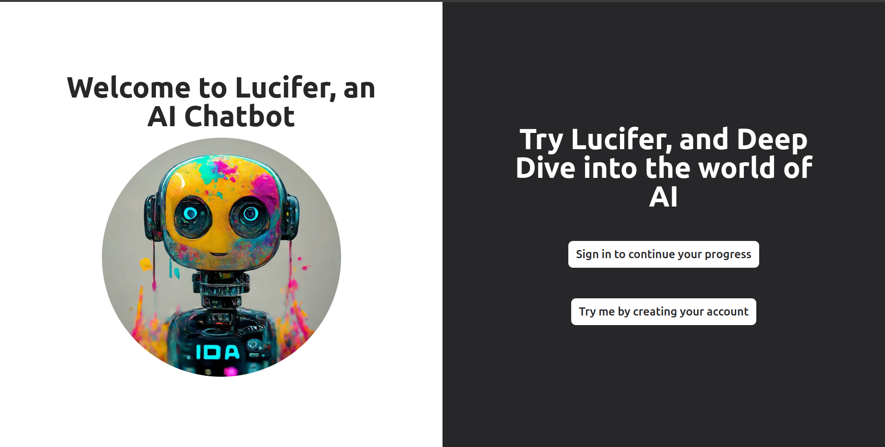
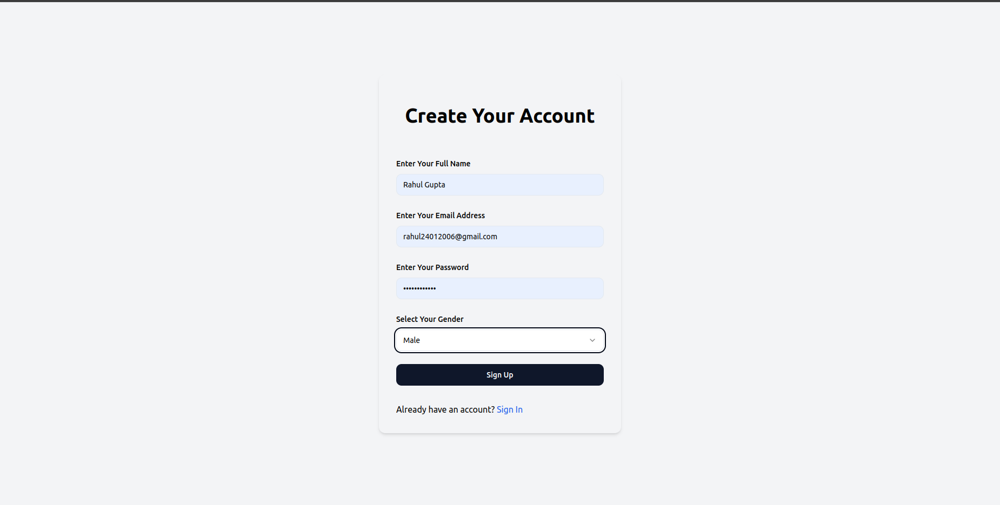
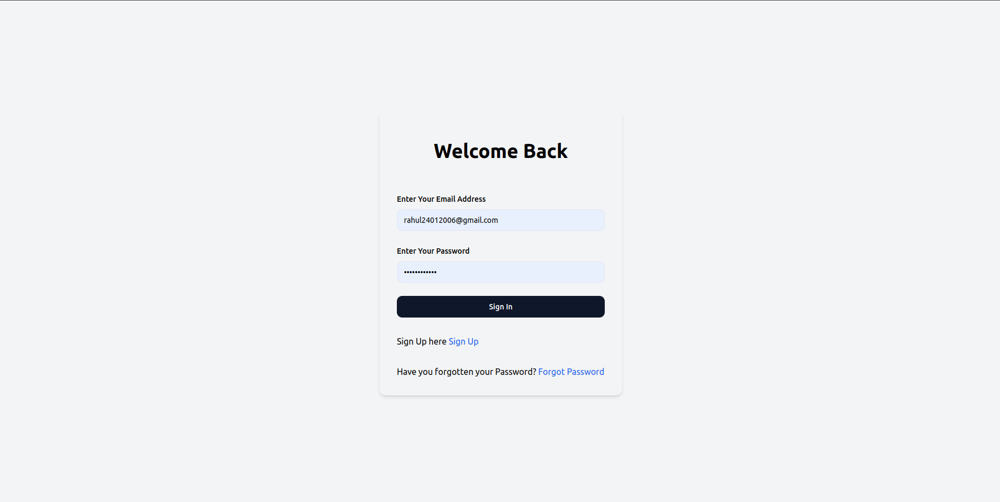
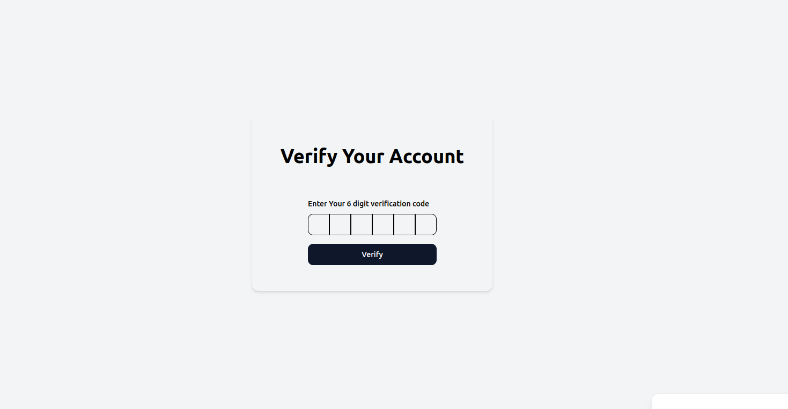
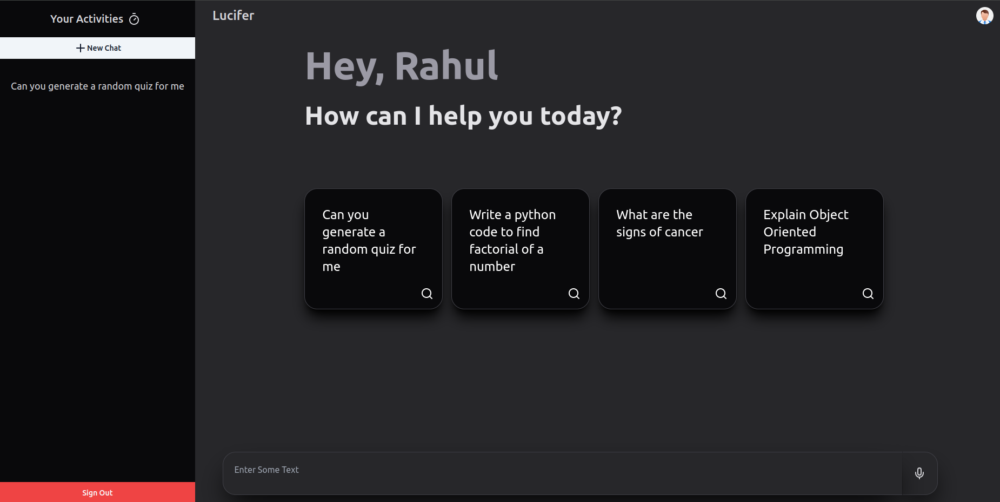
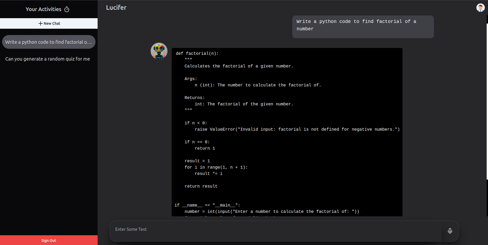
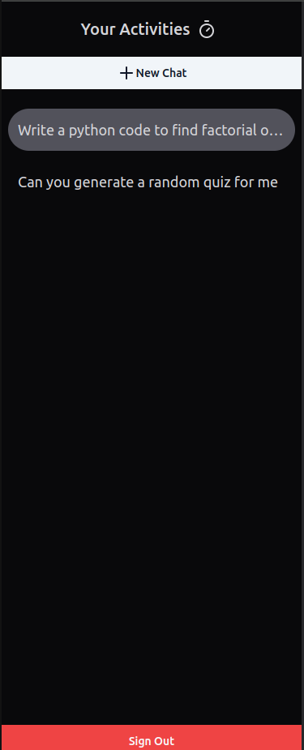
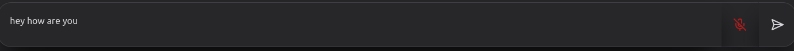

## Lucifer is an AI Chat Bot that utilizes Gemini API where users can interact with the bot, save sessions in the chat etc...

## Description 
It is an AI Chat Bot that uses Google's Gemini API. It fetch responses on user's request, stream messages live on frontend and store them in database also. It also has a feature to save the chat session in the chat itself. It is created using NextJs, Typescript, MongoDB and Zod for validation. Frontend is designed using shadCn and tailwind css. It has the capability to read aloud messages and can except voice messages as well. You can also copy response as it is shown on the screen. It uses Next Auth for authentication and Resend to send Emails. It also uses Redux for state management. For icons I have used Lucid React. useForm hook is used for handling form validation and submissions. Vercel AI Sdk is used for response streaming.

## Lucifer's Screenshot

#### Intro Screen

#### Authentication

#### Dashboard

#### Reponses

#### Your Activity or Chat Sessions

#### Voice Input

## Setup Guide

#### Server Setup

1. Open the terminal in `gemini`folder and run `npm install`

2. Create a new `.env` file in server folder and add the environment variables as mentioned in `.env.sample` file

3. Run `npm run dev` to start the application

#### Note -: Currently this application uses free version of Resend, it means it is able to send emails only to the admin of the Resend API key. So, if you want to use it's deployed version please login with credentials as follow -:
#### Email: `rg4005450@gmail.com`
#### Password: `rahulisgreat`

## Author's Social Links 🖥️

- [Twitter](https://twitter.com/rahu__24)
- [LinkedIn](https://www.linkedin.com/in/rahu24/)
- [Instagram](https://www.instagram.com/rahu__24/)
